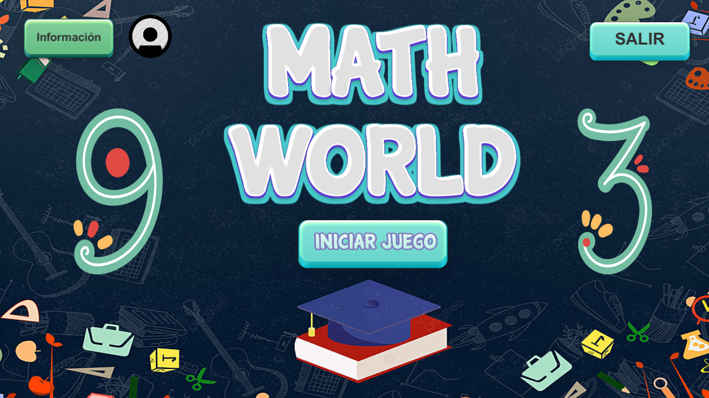

# MathWorld

El juego se basa en el viaje de un niño de aproximadamente 8 años el cual se sumergirá en el mundo de las matemáticas, consta de 4 niveles, cada nivel será un tema específico de matemáticas los cuales son: operaciones matemáticas, figuras geométricas, perímetros y áreas, razonamiento matemático. En los cuales el niño tendrá que ir resolviendo ejercicios acorde al nivel, cada vez que el niño supere el nivel de manera exitosa obtendrá recompensas que lo motivarán a seguir jugando esto debido a que al final del juego se enfrentará a un enemigo, el cual es una representación de la construcción de un antivalor como la ignorancia, pereza o irresponsabilidad

Desarrollo del juego para Desktop Windows con:

  - Unity 2019.4.1f
 
# Resultados

       

Ejecutable en : 

- https://gamejolt.com/games/mathworldidse/561552

Creditos a:

**Edwin Saavedra, Valeria Calderon , Luis Lorenzo**
